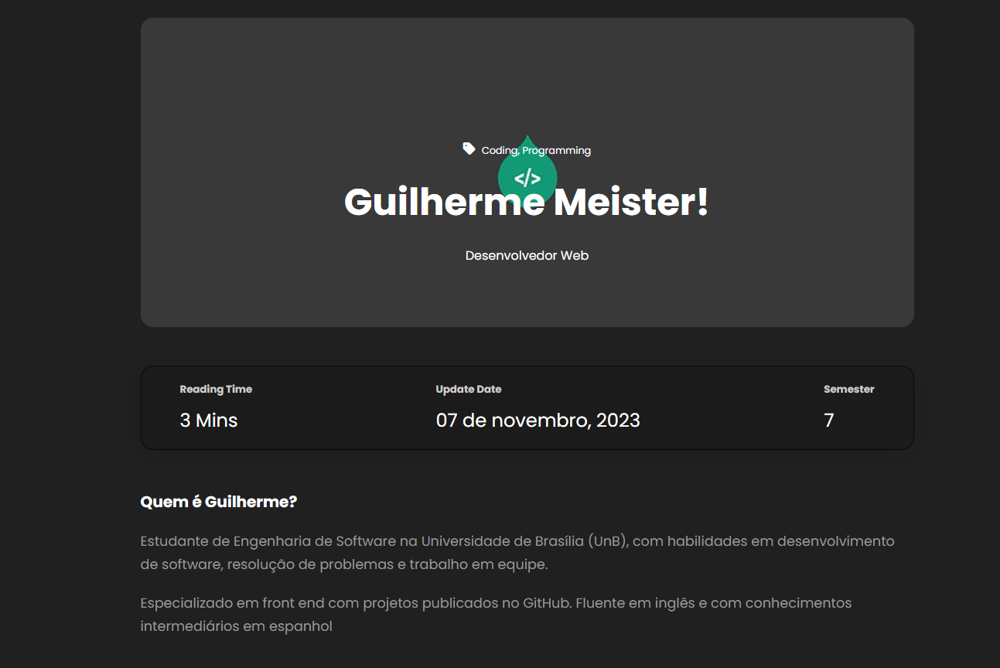

# Portfólio de Engenharia de Software

Este repositório apresenta o portfólio de **Guilherme Meister Correa**, estudante de engenharia de software da Universidade de Brasília (UnB). Atualmente, Guilherme é estagiário na PAULOOCTAVIO, onde desenvolve software para aplicações web e mobile.

## Projetos

O portfólio contém projetos desenvolvidos por Guilherme durante a graduação e o estágio. Os projetos estão organizados em pastas, com uma breve descrição de cada um.

## Habilidades

Guilherme possui as seguintes habilidades:

* Programação em Java, Python, JavaScript e TypeScript
* Desenvolvimento web (HTML, CSS e JavaScript)
* Desenvolvimento mobile (React Native e Flutter)
* Banco de dados (MySQL)
* Testes de software (JUnit e Mockito)
* Versionamento de código (Git e GitHub)

## Contatos

* Endereço de e-mail: meisterguilherme8@gmail.com
* LinkedIn: [https://www.linkedin.com/in/guilhermemeister/](https://www.linkedin.com/in/guilherme-meister-821b24210/)
* GitHub: [https://github.com/gmeister18/](https://github.com/gmeister18)

## Print da página

## Conclusão

Este portfólio é uma demonstração das habilidades e experiências de Guilherme em engenharia de software. Guilherme está sempre buscando aprender e se aperfeiçoar, e está ansioso para contribuir para o desenvolvimento de software de alta qualidade.
